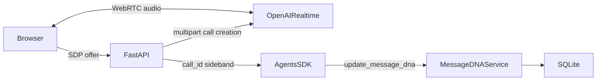

# Memo: The Musical — Milestones 1–3

## Product

Memo is a local-first “bureaucracy-to-banger preflight.” A producer speaks naturally about a
training reminder, announcement, product update, KPI report, or other business message. Memo
extracts accurate Message DNA for a downstream composer; it does not generate music.

The promise: turn a corporate ramble into an earworm-ready message in two minutes without
changing exact dates, names, numbers, URLs, claims, or mandated wording.

## Approved scope

The first three milestones prove:

1. Browser microphone and model audio use WebRTC. FastAPI creates the unified Realtime call,
   captures its call ID, and attaches server-side OpenAI Agents SDK controls.
2. Strict contracts capture presets, original request, Chorus, CTA, audience, active and
   superseded exact facts, vibe, humor, guardrails, assumptions, unresolved questions,
   transcript, and schema version.
3. Versioned SQLite persists projects and correction history. Earworm Readiness is derived from
   the Chorus, CTA, audience, active facts, and guardrails and is never persisted.

Authentication, collaboration, cloud sync, analytics, and music generation are non-goals.

## Voice behavior

One `RealtimeAgent` owns one server-side `update_message_dna` tool. It preserves exact facts,
does not fabricate missing business facts, asks one high-value question at a time, and
prioritizes CTA, audience, facts, and safety boundaries. It may be concise and humorous for
ordinary messages but must be direct and neutral for layoffs, safety incidents, disciplinary
topics, protected characteristics, and other sensitive subjects.

## Winning 60-second demo

- **0:00–0:07 — Hook:** “Business messages are boring. Catchy misinformation is worse. Memo is
  the safety preflight before a memo becomes music.”
- **0:07–0:27 — Live voice:** “Make our security training reminder memorable. Everyone,
  including contractors, must complete LearnHub by Friday, October 16 at 5 PM Pacific. It takes
  about 12 minutes. Give it playful spy-movie energy, but never joke about phishing victims.
  Actually, correction: Thursday, October 15—not Friday. Don’t invent prizes.”
- **0:27–0:36 — Follow-up:** The agent asks whether it may tease procrastination. Answer:
  “Lightly tease procrastination, never individuals.”
- **0:36–0:49 — Reveal:** Show the original deadline as superseded, corrected deadline active,
  plus Chorus, CTA, humor boundary, and compliance guardrails.
- **0:49–0:55 — Persistence:** Reload and show the project and correction history from SQLite.
- **0:55–1:00 — Close:** “Memo doesn’t write the song. It makes sure the song knows what it is
  allowed to sing.”

## Transparent fallback modes

The microphone, correction, follow-up, tool update, and reload path should run live. If
microphone capture fails, a visibly labeled **Use demo transcript** control must send the exact
prepared text through the live session. If network or Realtime service fails, a visibly labeled
**Replay last successful run** mode may show the stored run. Neither fallback may be presented
as live. Manual editing remains the final degradation path.

## Architecture

The long-lived API key stays on the server. OpenAI HTTP call creation, sideband attachment, and
project persistence are injected adapters behind domain ports, allowing offline contract tests.

## Acceptance

- Normal tests need no credentials or network.
- The SDP endpoint accepts `application/sdp`, forwards multipart SDP and model configuration,
  reads `Location`, attaches sideband by call ID, and returns the SDP answer.
- HTTP and attachment failures produce explicit gateway errors.
- Exact-fact corrections append linked history and mark the previous fact superseded.
- Reloading a SQLite repository restores strict project data.
- `task check` and `task smoke` pass locally.
